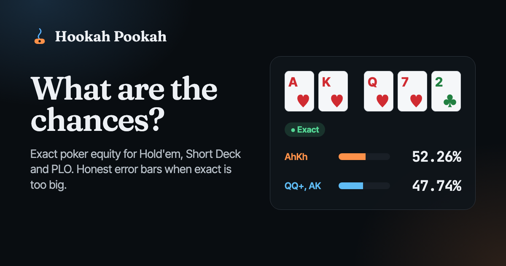

<div align="center">



# Hookah Pookah

**What are the chances?** Poker odds that tell you exactly, or tell you exactly how sure they are.

[](https://github.com/KarthikSubramanian07/Hookah-Pookah/actions/workflows/ci.yml)
[](https://github.com/KarthikSubramanian07/Hookah-Pookah/actions/workflows/stress.yml)
[](https://hookah-pookah.pages.dev)
[](LICENSE)


`poker` · `equity-calculator` · `texas-holdem` · `short-deck` · `omaha` · `monte-carlo` · `web-worker` · `cloudflare-pages`

</div>

---

Hookah Pookah is a poker equity calculator for **Texas Hold'em, Short Deck (Triton and classic rules), PLO4 and PLO5**. Give it hands, partial hands, random hands or weighted ranges, a board and dead cards, and it answers:

- **Equity, win and tie** for every player, split pots counted properly.
- **Hand chances**: how often each player finishes with a flush, a boat, quads.
- **Every next card**: a heatmap of how each possible turn or river moves your equity, with outs.
- **Equity by hand** inside a range, so you can see which combos are carrying it.
- **Pot odds**: the equity a call needs against the equity you have, with the error bar respected.

It is **exact whenever the math allows**. Heads-up preflop enumerates all 1,712,304 boards in about 35 ms. Range against range runs exactly in around 100 ms. When a spot is too big (say, five random opponents preflop), it switches to Monte Carlo on every CPU core and keeps sampling until the 95% confidence interval is as tight as you asked for. That interval is always on screen, and the result never shows more digits than it can defend.

Everything runs in your browser. No server, no account, no ads.

## Try it

**[hookah-pookah.pages.dev](https://hookah-pookah.pages.dev)**

| Route | Game |
|---|---|
| [`/holdem`](https://hookah-pookah.pages.dev/holdem) | Texas Hold'em |
| [`/short-deck`](https://hookah-pookah.pages.dev/short-deck) | Short Deck, Triton or classic rules |
| [`/plo`](https://hookah-pookah.pages.dev/plo) | Pot Limit Omaha (4 cards) |
| [`/plo5`](https://hookah-pookah.pages.dev/plo5) | 5 Card Omaha |

Spots live in the URL, so every calculation is shareable:
[`/holdem?p=AhKh&p=r:QQ+,AKs&b=Qh7h2c`](https://hookah-pookah.pages.dev/holdem?p=AhKh&p=r:QQ%2B,AKs&b=Qh7h2c)

### Fast input

- Press <kbd>/</kbd> and type a whole spot: `AhKh vs QQ+, AKs vs random on Ks7h2d dead 2c`
- Focus any card slot and type `a` `h`. <kbd>Backspace</kbd> clears it.
- Paint the 13x13 grid by dragging, pick a weight brush, right click (or press <kbd>S</kbd>) for individual suit combos.
- <kbd>Cmd</kbd> <kbd>Z</kbd> undoes, <kbd>Shift</kbd> <kbd>Cmd</kbd> <kbd>Z</kbd> redoes.

### Range syntax

| Notation | Meaning |
|---|---|
| `AA` `AKs` `AKo` `AK` | a hand class (`AK` is suited and offsuit) |
| `QQ+` `ATs+` `KTo+` | pairs upward, or kickers up to one below the top card |
| `22-55` `A2s-A5s` `K9o-KJo` | pair ladders and shared top card ladders |
| `T9s-54s` | constant gap ladders |
| `AhKh` | one exact combo |
| `15%` `10%-25%` | top hands by preflop all-in equity (vs 3 random hands by default, vs 1 selectable) |
| `random` `any` | every combo |
| `AA:0.5` `KK:25%` `[50]AQs, AJs[/50]` | weights |

When a combo appears twice, the later token wins, so `QQ+, AA:0.5` means what it says.

## How accurate is it?

Accuracy is the whole product, so it is checked against independent implementations rather than against itself.

| Check | Result |
|---|---|
| All 133,784,560 seven-card hands, category counts | exact match to the published table; 4,824 distinct ranks |
| Short deck seven-card counts, Triton and classic | exact match to an independent C enumerator; 762 and 752 ranks |
| [PokerHandEvaluator](https://github.com/HenryRLee/PokerHandEvaluator) test corpus: 5, 6, 7 card, PLO4, PLO5 (6.6M hands) | 0 inconsistencies, 0 ordering violations |
| Heads-up and 3-way preflop equities vs [OMPEval](https://github.com/zekyll/OMPEval) exhaustive enumeration | identical to 4 decimals |
| 35 random range vs range matchups vs OMPEval | max difference 5e-7 percentage points |
| Randomised spots (ranges, weights, partial hands, dead cards, all variants) vs a naive brute-force oracle | identical to 1e-14 |
| Monte Carlo 95% intervals over thousands of seeded runs | cover the exact answer 94.8% to 95.6% of the time |

A finding worth passing on: short deck equities quoted around the web (AsAh vs KsKh at 75.02%) use **classic** rules. Under **Triton** rules, where trips beat a straight, it is 74.96%. Hookah Pookah supports both and says which one it is using.

The unit suite runs these oracles on every push; `pnpm test:stress` runs the exhaustive and long-running versions (weekly in CI).

## Architecture

```
src/
  engine/            pure TypeScript, no DOM: runs in Node, Vitest and Web Workers
    cards.ts         card ids (rank * 4 + suit), parsing, formatting
    evaluator.ts     suit-mask evaluator and rule tables (standard, short deck Triton, classic)
    omp.ts           OMPEval-style rank-key perfect hash, filled from evaluator.ts
    omaha.ts         direct two-plus-three Omaha evaluation, no subset loop
    scorer.ts        showdown scorer used by every hot loop
    boardIso.ts      exact board enumeration with irrelevant-suit merging
    equity.ts        planning, exact enumeration, Monte Carlo, range breakdowns, next card
    ranges.ts        range grammar, percent orderings, formatting
    rng.ts           xoshiro128** with unbiased integer draws
  worker/            worker entry, message protocol, pool with sharded Monte Carlo
  state/             spot model, URL codec, quick spot parser, SEO titles
  ui/                React components and hand-written CSS
scripts/             orderings, perfect hash offsets, OG image, post-build SEO, stress suite
tests/               Vitest suites and the naive reference oracle
e2e/                 Playwright against the production build on the Pages runtime
```

### The engine, briefly

**Evaluation.** Cards fold into four 13-bit suit masks. Pairs, trips and quads fall out of XOR and AND across the masks, and straights and flushes come from 8192-entry tables, the idea popularised by pokersource's `poker-eval`. That evaluator defines the truth. For speed, `omp.ts` builds an [OMPEval](https://github.com/zekyll/OMPEval) style perfect hash (additive rank keys plus a flush table) whose values are *copied from* the mask evaluator, so both always agree, including under short deck reordering. Omaha uses a case analysis after [Open PQL](https://github.com/solve-poker/Poker-Query-Language) that never loops over the 60 or 100 two-plus-three subsets.

**Exact enumeration.** Range players are expanded into their conflict-free joint assignments. Random hole cards are enumerated per player, then boards are dealt with irrelevant-suit merging: a suit nobody can flush in collapses same-rank cards into one weighted branch. Joint deals that are suit relabelings of each other are enumerated once and replayed from a cache. Together these make exact mode the common case.

**Monte Carlo.** Range assignments are sampled either from the enumerated joint list (weighted, `O(log n)`) or by rejection of whole assignments, never player by player, which would be biased. Hole cards and boards come from a partial Fisher-Yates shuffle. Each worker runs an independent seeded shard in short slices; the pool merges raw sums (weights, equity, squared equity, categories) so the combined standard error is exact, and stops every shard cooperatively once the target is reached.

**Planning.** Before running, the engine estimates the work: joint deals after suit caching, times runouts, times players. Below the budget it enumerates; above it samples.

## Develop

Requires Node 22.18+ (TypeScript runs natively) and pnpm.

```bash
pnpm install
pnpm dev             # http://localhost:5173
pnpm test            # unit and oracle suites
pnpm test:e2e        # Playwright on the built site (runs wrangler pages dev)
pnpm test:stress     # exhaustive counts, PHEvaluator corpus, long fuzz, calibration
pnpm lint && pnpm typecheck
pnpm build           # dist/ with route pages, sitemap and headers
```

Generators (outputs are committed):

```bash
node scripts/gen-preflop-ranking.ts   # percent orderings: exact vs 1 random, 20M trials vs 3
node scripts/gen-omp-offsets.ts       # perfect hash offsets
node scripts/gen-og.ts                # social card and icons, with live engine numbers
```

## Deploy

Zero touch. The site is static and lives on Cloudflare Pages as project `hookah-pookah`, connected to this repository.

1. Every push and pull request runs lint, typecheck, unit tests with coverage, the build, and the Playwright suite against the production build on the Pages runtime.
2. When `main` is green, the `deploy` job calls the project's Pages deploy hook (secret `CLOUDFLARE_DEPLOY_HOOK`), waits until [hookah-pookah.pages.dev](https://hookah-pookah.pages.dev) serves the exact bundle CI built, and smoke tests every route.

Manual deploys still work with `pnpm deploy` (wrangler direct upload).

## Credits

Standing on the shoulders of [OMPEval](https://github.com/zekyll/OMPEval) (ISC), [PokerHandEvaluator](https://github.com/HenryRLee/PokerHandEvaluator) (Apache-2.0), [Open PQL](https://github.com/solve-poker/Poker-Query-Language) (MIT), [PokerStove](https://github.com/andrewprock/pokerstove) (BSD-3) and pokersource's poker-eval (read, not copied).

## License

[MIT](LICENSE) © Karthik Subramanian
